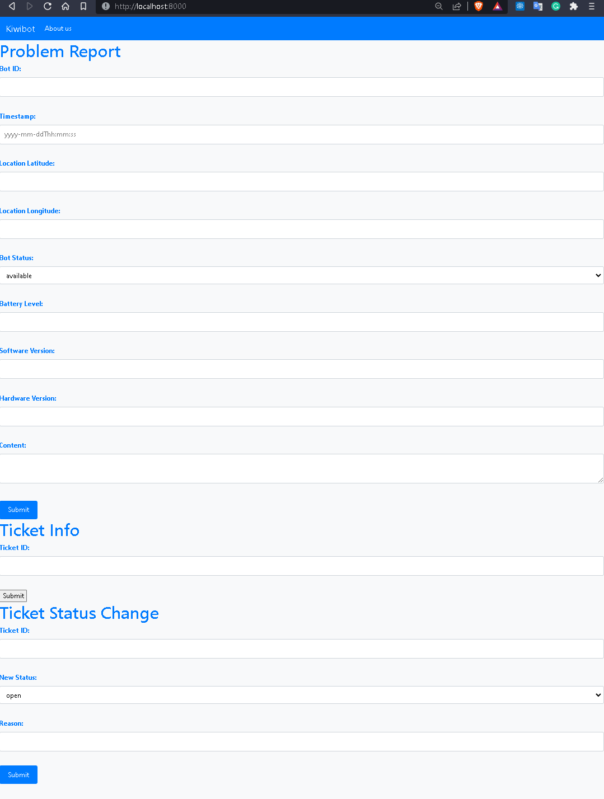

# Kiwibot-by-Xero-OpenAi-ChatGPT

This is a sample API built using Python and FastAPI, consuming OpenAI. It features an endpoint to chat with ChatGPT to support reporting problems for Kiwibot.

## Overview:

In this document, you can find a detailed explanation of the project setup, technologies, and available features.
This is the API built up to the deadline of the case study.

## Index

1. [ Project sample ](#sample)
2. [ Getting started ](#getting-started)
3. [ Available endpoints ](#available-endpoints)

## Sample

- Video example: [Video Link](https://drive.google.com/file/d/1_uIGKtaiRQNJSLIu2Q7A2ynvM2YYJt71/view?usp=share_link) The video have copy the keys file, don't create from zero.
- Share Postman Collection: [Postman Collection Link](https://drive.google.com/file/d/1TV0KIfxWZQIAesjOSYIeUkA1sDcoK62r/view?usp=share_link)

## Getting started

To run this API on your local machine, follow these steps:

1. Clone the repository:

```bash
git clone git@github.com:JoseJulianMosqueraFuli/kiwibot-by-xero-chatgpt-test.git
```

2. Navigate into the cloned directory:

```bash
cd kiwibot-by-xero-chatgpt-test
```

3. Create a `.env` file like `.env.example` :

```python
OPEN_API_KEY = <your_openai_api_key>
FIREBASE_API_KEY = <your_firebase_api_key>
SERVICE_ACCOUNT_KEY_FILE = <your_service_account_key_file>
GOOGLE_MAPS_API_KEY = <your_google_maps_api_keu>
```

4. Create a `keys.json` file like `.example.keys.json`, this file must be created in the fold that appears in the example:

- NOTE: You can find the example inside the folder /app:

```python
{
  "type": "tipo_de_cuenta",
  "project_id": "id_del_proyecto",
  "private_key_id": "id_de_la_llave_privada",
  "private_key": "llave_privada",
  "client_email": "correo_del_cliente",
  "client_id": "id_del_cliente",
  "auth_uri": "uri_de_autenticacion",
  "token_uri": "uri_del_token",
  "auth_provider_x509_cert_url": "url_del_proveedor_de_autenticacion_x509",
  "client_x509_cert_url": "url_del_cliente_x509_cert"
}

```

5. Build and run the Docker container:

```bash
docker-compose up --build
```

6. The API should now be available at http://localhost:8000.\*

7. If you require to execute a tests:

```bash
docker-compose run fastAPI python3 -m pytest
```

for this version have to break changes, the 3 tests don't pass until the moment, requiring a change

## Available endpoints

### Login

#### POST /problem-report

```jsx
http://localhost:8000/login_user
```

Input

```x-www-form-urlencoded
email =
password =
```

Output

```json
{
    "kind": "toolik",
    "localId": "ID",
    "email": "example@example.com",
    "displayName": "kiwi-bot",
    "idToken": "IDTOKEN", <this requiere for access>
    "registered": true,
    "refreshToken": "RefreshToken",
    "expiresIn": "1200"}
```

### Problem Report Endpoint

#### POST /problem-report

```jsx
http://localhost:8000/problem-report
```

Input

```jsx
{
  "content": "My Kiwibot is moving slow and the device is hot. The hardware version is a bit old",
  "heartbeat": {
    "bot_id": "abc12435",
    "timestamp" : "2023-05-09T12:00:00",
    "location": {
      "lat": 40.731,
      "lon": -73.997
    },
    "status": "available",
    "battery_level": 80.08,
    "software_version": "v1.0",
    "hardware_version": "v2.0"
  }
}
```

Response Ticket

```jsx
{
    "ticket_id": "77af15af-4536-435d-bd2d-323c3707e2cf",
    "problem_location": "New York University, Bond Street, Manhattan Community Board 2, Manhattan, New York County, City of New York, New York, 10012, United States",
    "problem_type": "hardware",
    "summary": "The Kiwibot is facing a hardware problem that is causing the reduced speed and overheating. Given that the hardware version is old, it might be necessary to replace certain components or upgrade the Kiwibot to resolve the problem. Further investigation is recommended to identify the root cause of the issue.",
    "bot_id": "abc12435",
    "status": "open",
    "status_changes": []
}
```

### Ticket

#### GET /ticket/{ticket_id}

```jsx
http://localhost:8000/ticket/95b13970-2819-4684-8ef5-2b8aef8c825c
```

response

```jsx
{
    "ticket_id": "95b13970-2819-4684-8ef5-2b8aef8c825c",
    "problem_location": "New York University, Bond Street, Manhattan Community Board 2, Manhattan, New York County, City of New York, New York, 10012, United States",
    "problem_type": "hardware",
    "summary": "The hardware issue with the Kiwibot at the NY location is related to the wheels repeatedly getting stuck when attempting to navigate uneven surfaces.",
    "bot_id": "abc12435",
    "status": "open",
    "status_changes": []
}
```

#### PUT /ticket/{ticket_id}/status

```jsx
http://localhost:8000/ticket/{ticket_id}/status
```

Input

```jsx
{
  "new_status": "closed",
  "reason": "Ticket is finish reviewed"
}
```

Output

```jsx
{
    "ticket_id": "2575574d-26dd-485c-8a70-80ca42b52f56",
    "problem_location": "New York University, Bond Street, Manhattan Community Board 2, Manhattan, New York County, City of New York, New York, 10012, United States",
    "problem_type": "hardware",
    "summary": "Issue Reporting Ticket\n\nLocation: NY\n\nType of Issue: Hardware\n\nDescription of Issue: The wheels of the Kiwibot are not moving properly and are getting stuck when navigating uneven surfaces.\n\nSteps Taken to Reproduce Issue: Navigating the Kiwibot on uneven surfaces.\n\nRelevant Information: The Kiwibot is also having trouble navigating around obstacles and may require additional testing.\n\nPriority Level: High\n\nDate Submitted: [Current Date] \n\nThank you for your attention to this matter. Please let me know if any additional information is needed.",
    "bot_id": "abc123",
    "status": "closed",
    "status_changes": [
        {
            "timestamp": "2023-05-09T14:34:45.133064+00:00",
            "status": "in progress",
            "reason": "Ticket is being worked on"
        },
        {
            "timestamp": "2023-05-09T20:18:02.314041",
            "status": "closed",
            "reason": "Ticket is finish reviewed"
        }
    ]
}
```

#### PUT /ticket/{ticket_id}/assign

```jsx
http://localhost:8000/ticket/{ticket_id}/assign
```

Input

```jsx
{
  "agent_id": "ID_DEL_AGENTE"
}
```

Output

```jsx
{{
    "ticket_id": "ab7dd907-14f9-4c4c-a979-f5381c9f52cf",
    "problem_location": "Pecos County, Texas, United States",
    "problem_type": "software",
    "summary": "The issue with the Kiwibot could be a software problem, as no notification is received through the app. This problem is causing a communication breakdown between the delivery service and the customer, leading to inquiries about the service.",
    "bot_id": "Pruebaid1",
    "status": "open",
    "status_changes": [],
    "assigned_agent": "ID_DEL_AGENTE"
}
}
```

## Version

### v2 deadline study case

#### Improvements:

- Add a feature to the GPT model: prioritize the addition of notes in the model. (Restrictions: The context of GPT-3.5 is limited to 4096 tokens. GPT-4 is a multimodal model, meaning it has more space for context, enhanced creativity, and the ability to capture information beyond just text.)
- Design a more feature User Interface, and useful, for the moment only can use Ticket info because don't require authentication.

  

- Updating the test, and add for the new features.

### Author

Built by Jose Julian Mosquera Fuli.
